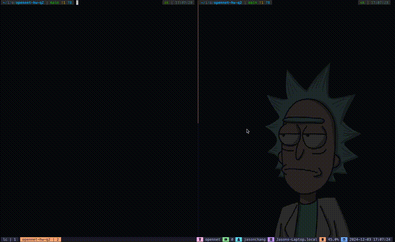

# Question 2: Message Brokers

## How to run?

### Prerequisites
- Docker installed on your machine.

### Steps

```bash
# clone the repository
$ git clone git@github.com:JasonJungler/opennet-hw-q2.git

# Start RabbitMQ & receiver container using `docker-compose`
$ docker-compose up

# Setup virtual environment using the tool you preferred
# 1. python -m venv .venv && source .venv/bin/activate && pip install -r requirements.txt
# 2. uv sync (https://docs.astral.sh/uv/)

# activate virtual environment
$ source .venv/bin/activate

# execute sender function
(.venv)$ python src/main.py send 
```

## Project directory

```bash
.
├── Dockerfile
├── README.md
├── demo.gif
├── docker-compose.yml # configurations for RabbitMQ & receiver 
├── pyproject.toml     # project environment settings
├── requirements.txt
└── src
    └── main.py        # main function for sender/receiver
```

## Demo




